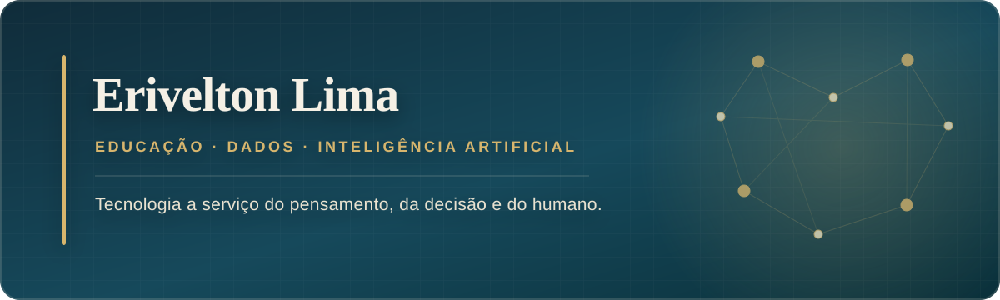

 

## Sobre mim

Sou **Técnico em Assuntos Educacionais na Universidade Federal de Pelotas (UFPel)**, formado em **Letras — Português e Francês** e mestrando em **Política Social**.

Investigo e construo formas de aproximar **educação, gestão, dados e inteligência artificial**. Meu trabalho parte de uma pergunta simples: como reduzir o peso das tarefas repetitivas sem perder aquilo que exige interpretação, responsabilidade e presença humana?

> Tecnologia não como substituição do pensamento, mas como infraestrutura para pensar e decidir melhor.

<strong>English summary</strong>

I work at the intersection of **education, public management, data and artificial intelligence**. With a background in Portuguese and French Language and Literature and ongoing graduate research in Social Policy, I build practical tools that turn repetitive cognitive work into transparent, auditable workflows.

## Eixos de atuação

| Educação e política social | Dados e decisão | IA e automação |
|---|---|---|
| Tecnologia educacional, formação humanística e gestão universitária | Sistemas de apoio à decisão e organização de evidências | Agentes, memória persistente e automação de fluxos de trabalho |

## Projetos selecionados

### [Supermilhas](https://github.com/EriveltonLima/supermilhas)

Extensão para Chrome que transforma pontos, milhas e Avios em estimativas claras em reais nos próprios sites de pesquisa de passagens-prêmio. Os cálculos acontecem localmente, sem anúncios ou telemetria.

`JavaScript` · `Chrome Extension` · `Manifest V3` · `Privacidade por padrão`

### [GVR Decision](https://github.com/EriveltonLima/gvr-decision)

Aplicação para centralizar demandas institucionais e apoiar fluxos hierárquicos de análise, aprovação e decisão.

`React` · `Supabase` · `Tailwind CSS` · `Gestão pública`

### [ORBIT — Antigravity Autonomy Framework](https://github.com/EriveltonLima/antigravity-framework)

Framework experimental para execução auditável de tarefas por agentes de IA, com filas, retentativas, logs, lotes paralelos e handoffs entre agentes.

`PowerShell` · `Agentes de IA` · `Automação` · `Observabilidade`

### [Gerador de Simulado Interativo](https://github.com/EriveltonLima/gerador-de-simulado-interativo)

Aplicação educacional para criação e realização de simulados interativos com apoio de IA.

`TypeScript` · `React` · `IA aplicada à educação`

## Laboratório pessoal de IA

Minha infraestrutura pessoal de IA é um espaço de experimentação aplicada. Nela, exploro três camadas complementares:

- **Telos:** propósito e direção antes da automação;
- **Substrate:** dados e evidências como base das decisões;
- **PAI:** agentes, memória e ferramentas para executar fluxos persistentes.

O ciclo de trabalho é contínuo: **observar → pensar → planejar → executar → aprender**.

## Ferramentas que uso

**Sistemas e automação** 
Linux · Bash · PowerShell · Docker · Proxmox · ZFS · GitHub Actions

**Aplicações e dados** 
Python · FastAPI · PostgreSQL · Supabase · React · TypeScript · Tailwind CSS

**Conhecimento e IA** 
LLMs · fluxos com agentes · Fabric · gestão de contexto · Obsidian

## Formação e interesses de pesquisa

- Mestrado em Política Social — UFPel *(em andamento)*
- Letras — Português e Francês — UFPel
- Inteligência artificial e cognição humana
- Tecnologia educacional e transformação digital
- Dados aplicados à política social
- Sistemas pessoais de gestão do conhecimento

---

### Vamos conversar?

Estou aberto a diálogos e colaborações sobre **educação, gestão pública, automação e IA aplicada**.

[LinkedIn](https://www.linkedin.com/in/eriveltonlima/) · [Portfólio](https://eriveltonlima.github.io) · [E-mail](mailto:erivelton.lima@ufpel.edu.br)

Pelotas, Rio Grande do Sul, Brasil

