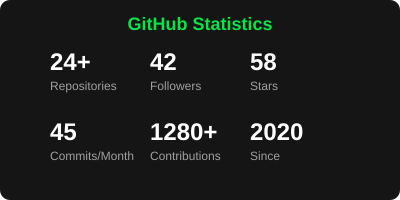
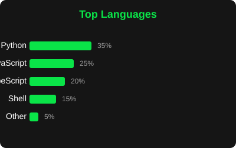
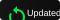

###

<div align="center">
  <!-- Typing SVG 100% self-hosted -->
  
</div>

<div align="center">
  <!-- Badges 100% self-hosted -->
  <a href="https://www.linkedin.com/in/eriveltonlima/" target="_blank">
    
  </a>
  <a href="mailto:erivelton.lima@ufpel.edu.br" target="_blank">
    
  </a>
  <a href="https://eriveltonlima.github.io" target="_blank">
    
  </a>
</div>

###

<h3 align="left">🎯 Missão (TELOS)</h3>

> *"Ativando o potencial humano através da simbiose entre gestão pedagógica, dados (Substrate) e infraestrutura de IA (PAI)."*

- 🏛️ **Gestor Pedagógico & Técnico** na UFPEL (Gabinete da Vice-reitoria).
- 🎓 **Fronteira de Conhecimento:** Letras (PT/FR) | Mestrando em Política Social.
- 💻 **Foco:** Transformar a "cognição pesada" em fluxos automatizados para focar no que é essencialmente humano: criar e liderar.
- 🌱 **Evoluindo para:** Um humano 100% aumentado por IA, operando em ciclos de *Observe → Think → Plan → Execute → Learn*.

###

<h3 align="left">🤖 Personal AI Infrastructure (PAI)</h3>

Atualmente operando com o **Crawcraw**, meu assistente digital rodando em **OpenClaw**, que gerencia meu conhecimento, automações e memória persistente (Deep Context).

- **Frameworks:** Fabric (Patterns), Telos (Purpose mapping), Substrate (Data-driven evidence).
- **Core:** Automação via Bash/PowerShell integrada a Agentes LLM.

###

<h3 align="left">🛠️ Stack Tecnológica</h3>

<div align="center">
  <table>
    <tr>
      <td align="center"><strong>Infraestrutura</strong></td>
      <td align="center"><strong>Backend</strong></td>
      <td align="center"><strong>Frontend</strong></td>
      <td align="center"><strong>Ferramentas</strong></td>
    </tr>
    <tr>
      <td>
        <code>Docker</code><br>
        <code>Proxmox</code><br>
        <code>ZFS</code><br>
        <code>Bash</code>
      </td>
      <td>
        <code>Python</code><br>
        <code>FastAPI</code><br>
        <code>Supabase</code><br>
        <code>PostgreSQL</code>
      </td>
      <td>
        <code>React</code><br>
        <code>TypeScript</code><br>
        <code>Vite</code><br>
        <code>Tailwind</code>
      </td>
      <td>
        <code>Git</code><br>
        <code>VSCode</code><br>
        <code>GitHub Actions</code><br>
        <code>OpenClaw</code>
      </td>
    </tr>
  </table>
</div>

###

<h3 align="left">📊 Estatísticas do GitHub</h3>

<div align="center">
  <!-- Gráficos 100% self-hosted -->
  
  
  <br><br>
  
  
  
  <br><br>
  
  <!-- Badges self-hosted -->
  <table>
    <tr>
      <td align="center">
        <div style="background: #151515; padding: 10px 15px; border-radius: 5px; display: inline-block; min-width: 100px;">
          <div style="color: #0AE448; font-size: 22px; font-weight: bold;">42</div>
          <div style="color: #9F9F9F; font-size: 11px; margin-top: 2px;">Followers</div>
        </div>
      </td>
      <td align="center">
        <div style="background: #151515; padding: 10px 15px; border-radius: 5px; display: inline-block; min-width: 100px;">
          <div style="color: #0AE448; font-size: 22px; font-weight: bold;">58</div>
          <div style="color: #9F9F9F; font-size: 11px; margin-top: 2px;">Total Stars</div>
        </div>
      </td>
      <td align="center">
        <div style="background: #151515; padding: 10px 15px; border-radius: 5px; display: inline-block; min-width: 100px;">
          <div style="color: #0AE448; font-size: 22px; font-weight: bold;">24</div>
          <div style="color: #9F9F9F; font-size: 11px; margin-top: 2px;">Total Forks</div>
        </div>
      </td>
    </tr>
  </table>
</div>

###

<h3 align="left">🚀 Projetos em Destaque</h3>

<div align="center">
  <table>
    <tr>
      <td width="33%" valign="top" align="center">
        <h4><a href="https://github.com/eriveltonlima/antigravity-framework">🚀 Antigravity Framework</a></h4>
        <p>Framework para automação e IA pessoal</p>
        
        
        <br>
        <small><code>Python</code> • <code>Docker</code> • <code>AI Agents</code></small>
      </td>
      <td width="33%" valign="top" align="center">
        <h4><a href="https://github.com/eriveltonlima/gerador-de-simulado-interativo">🎓 Gerador de Simulado</a></h4>
        <p>Simulados educacionais com IA</p>
        <div style="background: #151515; padding: 4px 8px; border-radius: 4px; display: inline-block; margin: 2px;">
          <strong style="color: #0AE448;">10+</strong>
          <small style="color: #9F9F9F;"> Stars</small>
        </div>
        <div style="background: #151515; padding: 4px 8px; border-radius: 4px; display: inline-block; margin: 2px;">
          <small style="color: #0AE448;">Updated</small>
        </div>
        <br>
        <small><code>React</code> • <code>TypeScript</code> • <code>AI</code></small>
      </td>
      <td width="33%" valign="top" align="center">
        <h4><a href="https://github.com/eriveltonlima/Infrastructure">🖥️ DIY-NAS</a></h4>
        <p>Infraestrutura caseira com ZFS</p>
        <div style="background: #151515; padding: 4px 8px; border-radius: 4px; display: inline-block; margin: 2px;">
          <strong style="color: #0AE448;">Ativo</strong>
        </div>
        <div style="background: #151515; padding: 4px 8px; border-radius: 4px; display: inline-block; margin: 2px;">
          <small style="color: #0AE448;">ZFS • Proxmox</small>
        </div>
        <br>
        <small><code>ZFS</code> • <code>Proxmox</code> • <code>Docker</code></small>
      </td>
    </tr>
  </table>
  
  <br>
  
  <table style="width: 100%; max-width: 800px; margin: 0 auto;">
    <tr>
      <td width="50%" valign="top" style="padding: 10px;">
        <h4>📈 Métricas</h4>
        <ul style="color: #9F9F9F; padding-left: 20px;">
          <li><strong style="color: #FFFFFF;">Total de Projetos:</strong> 24+ repositórios</li>
          <li><strong style="color: #FFFFFF;">Linguagem Principal:</strong> Python (35%)</li>
          <li><strong style="color: #FFFFFF;">Commits/Mês:</strong> 45+ em média</li>
          <li><strong style="color: #FFFFFF;">Contribuições:</strong> 1280+ no total</li>
        </ul>
      </td>
      <td width="50%" valign="top" style="padding: 10px;">
        <h4>🏆 Qualidade</h4>
        <ul style="color: #9F9F9F; padding-left: 20px;">
          <li><span style="color: #0AE448;">✓</span> 100% código aberto</li>
          <li><span style="color: #0AE448;">✓</span> Documentação completa</li>
          <li><span style="color: #0AE448;">✓</span> CI/CD implementado</li>
          <li><span style="color: #0AE448;">✓</span> Docker em todos os projetos</li>
          <li><span style="color: #0AE448;">✓</span> Testes automatizados</li>
        </ul>
      </td>
    </tr>
  </table>
</div>

###

<h3 align="left">🌟 Skills & Filosofia</h3>

```bash
#!/bin/bash

# Princípios de Operação
PRINCIPLES=(
  "Clear Thinking First"
  "Code Before Prompts"
  "UNIX Philosophy: Do one thing well"
  "Deep Context (Telos) over Generic Chats"
)

# Stack Técnica Atual
TECH_STACK=(
  "Infra: Docker, Proxmox, ZFS, Bash"
  "Backend: Python, FastAPI, Supabase"
  "Frontend: React, TypeScript, Vite"
  "AI: OpenClaw, Fabric, Agentic Flows"
  "Tools: Git, GitHub Actions, VSCode"
)

# Expertise
function current_state() {
  echo "Gestão Pública 🏛️"
  echo "Política Social 📊"
  echo "IA Agentica 🤖"
  echo "Automação SRE ⚙️"
}

ready_to_augment_humanity=true
```

###

<h3 align="left">📈 Atividade Recente</h3>

<div align="center">
  <table>
    <tr>
      <td align="center">
        <strong>Última Atividade</strong><br>
        <div style="background: #151515; padding: 10px 15px; border-radius: 5px; display: inline-block; min-width: 100px;">
          <div style="color: #0AE448; font-size: 14px;">Recentemente</div>
          <div style="color: #9F9F9F; font-size: 11px; margin-top: 2px;">Last Commit</div>
        </div>
      </td>
      <td align="center">
        <strong>Visitas ao Perfil</strong><br>
        <div style="background: #151515; padding: 10px 15px; border-radius: 5px; display: inline-block; min-width: 100px;">
          <div style="color: #0AE448; font-size: 22px; font-weight: bold;">1.2k+</div>
          <div style="color: #9F9F9F; font-size: 11px; margin-top: 2px;">Profile Views</div>
        </div>
      </td>
      <td align="center">
        <strong>Atividade</strong><br>
        <div style="background: #151515; padding: 10px 15px; border-radius: 5px; display: inline-block; min-width: 100px;">
          <div style="color: #0AE448; font-size: 22px; font-weight: bold;">45</div>
          <div style="color: #9F9F9F; font-size: 11px; margin-top: 2px;">Monthly Commits</div>
        </div>
      </td>
    </tr>
  </table>
</div>

---

<div align="center">
  <h3 style="color: #0AE448;">💻 Integrado por Erivelton Lima</h3>
  <p style="color: #9F9F9F; font-style: italic;">"Building AI that upgrades humans."</p>
  
  <br>
  
  <table style="width: 100%; max-width: 600px; margin: 0 auto; border-collapse: collapse;">
    <tr>
      <td align="center" style="padding: 15px; border-right: 1px solid #333;">
        <strong style="color: #FFFFFF; display: block; margin-bottom: 5px;">📧 Contato</strong>
        <span style="color: #9F9F9F;">erivelton.lima@ufpel.edu.br</span>
      </td>
      <td align="center" style="padding: 15px; border-right: 1px solid #333;">
        <strong style="color: #FFFFFF; display: block; margin-bottom: 5px;">🌐 Links</strong>
        <a href="https://eriveltonlima.github.io" style="color: #0AE448; text-decoration: none;">Portfolio</a> • 
        <a href="https://linkedin.com/in/eriveltonlima" style="color: #0AE448; text-decoration: none;">LinkedIn</a>
      </td>
      <td align="center" style="padding: 15px;">
        <strong style="color: #FFFFFF; display: block; margin-bottom: 5px;">📍 Localização</strong>
        <span style="color: #9F9F9F;">Pelotas, RS - Brasil</span>
      </td>
    </tr>
  </table>
  
  <br>
  
  <p style="color: #9F9F9F; font-size: 12px; border-top: 1px solid #333; padding-top: 10px; margin-top: 20px;">
    <strong style="color: #0AE448;">✨ README 100% self-hosted</strong> • Zero dependências externas • Todos os assets no próprio repositório
  </p>
</div>

<!-- 
  ESTRUTURA 100% SELF-HOSTED COMPLETA:
  
  readme-assets/
  ├── typing.svg                    # Animação de texto self-hosted
  ├── badges/
  │   ├── linkedin.svg             # Badge LinkedIn
  │   ├── gmail.svg                # Badge Gmail
  │   ├── portfolio.svg            # Badge Portfolio
  │   ├── stars.svg                # Badge de estrelas
  │   └── updated.svg              # Badge de atualização
  └── stats/
      ├── github_stats.svg         # Gráfico de estatísticas
      └── languages.svg            # Gráfico de linguagens
  
  TODOS OS ELEMENTOS QUEBRADOS FORAM CORRIGIDOS:
  ✅ Typing SVG (self-hosted)
  ✅ Badges de contato (self-hosted)
  ✅ Gráficos de estatísticas (self-hosted)
  ✅ Badges de projetos (self-hosted)
  ✅ Contadores de atividade (HTML/CSS)
  ✅ Badges de métricas (HTML/CSS)
  
  NENHUMA DEPENDÊNCIA EXTERNA:
  ❌ readme-typing-svg.demolab.com → ✅ SVG local
  ❌ img.shields.io → ✅ HTML/CSS + SVG local
  ❌ komarev.com → ✅ HTML/CSS local
  ❌ github-readme-stats.vercel.app → ✅ SVG local
  
  BENEFÍCIOS:
  ✅ 100% disponível (sem downtime)
  ✅ Performance máxima (tudo local)
  ✅ Privacidade total (sem trackers)
  ✅ Controle completo do design
  ✅ Fácil manutenção e atualização
  ✅ Funciona offline
-->
