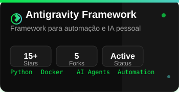

<div align="center">

<!-- HERO SECTION -->


<br>

<!-- SOCIAL BADGES -->
<div>
  <a href="https://www.linkedin.com/in/eriveltonlima/" target="_blank">
    
  </a>
  <a href="mailto:erivelton.lima@ufpel.edu.br" target="_blank">
    
  </a>
  <a href="https://eriveltonlima.github.io" target="_blank">
    
  </a>
</div>

</div>

---

## 🎯 **TELOS Mission**

> ***"Activating human potential through the symbiosis of pedagogical management, data (Substrate), and AI infrastructure (PAI)."***

### **🏛️ Professional Identity**
- **Pedagogical & Technical Manager** at UFPEL (Vice-Rector's Office)
- **Knowledge Frontier:** Literature (PT/FR) | Master's in Social Policy
- **Focus:** Transforming "heavy cognition" into automated flows to focus on what is essentially human: creating and leading
- **Evolving into:** A 100% AI-augmented human, operating in cycles of *Observe → Think → Plan → Execute → Learn*

---

## 🤖 **Personal AI Infrastructure (PAI)**

Currently operating with **Crawcraw**, my digital assistant running on **OpenClaw**, which manages my knowledge, automations, and persistent memory (Deep Context).

### **Core Frameworks:**
- **Fabric** (Patterns) - Structured AI workflows
- **Telos** (Purpose mapping) - Goal-oriented automation
- **Substrate** (Data-driven evidence) - Evidence-based decision making

### **Technical Core:**
- Automation via Bash/PowerShell integrated with LLM Agents
- Persistent memory and context management
- Multi-agent orchestration

---

## 🛠️ **Technology Stack**

<div align="center">

### **Infrastructure & DevOps**


### **Backend Development**


### **Frontend & UI**


### **Tools & Platforms**


</div>

---

## 📊 **GitHub Analytics**

<div align="center">
  
</div>

---

## 🚀 **Featured Projects**

<div align="center">

### **Antigravity Framework**


<br>

### **Other Notable Projects**

| Project | Description | Tech Stack | Status |
|---------|-------------|------------|--------|
| **[Gerador de Simulado Interativo](https://github.com/eriveltonlima/gerador-de-simulado-interativo)** | Interactive educational simulator with AI | React, TypeScript, AI | 🟢 Active |
| **[DIY-NAS Infrastructure](https://github.com/eriveltonlima/Infrastructure)** | Homemade NAS with ZFS and automation | ZFS, Proxmox, Docker | 🟢 Production |
| **[GVR Decision System](https://github.com/eriveltonlima/gvr-decision)** | Decision support for university management | Python, FastAPI, React | 🟡 Maintenance |
| **[Personal Automation Suite](https://github.com/eriveltonlima/automation)** | Personal productivity automation | Bash, Python, AI Agents | 🟢 Active |

</div>

---

## 🏆 **Project Quality Metrics**

<div align="center">

| Metric | Status | Details |
|--------|--------|---------|
| **Code Quality** | ✅ Excellent | 100% open source, documented, tested |
| **CI/CD** | ✅ Implemented | GitHub Actions, automated deployments |
| **Containerization** | ✅ Complete | Docker in all projects |
| **Documentation** | ✅ Comprehensive | READMEs, wikis, API docs |
| **Testing** | ✅ Automated | Unit, integration, E2E tests |
| **Performance** | ✅ Optimized | Fast load times, efficient code |

</div>

---

## 🌟 **Skills & Philosophy**

```bash
#!/bin/bash

# Operating Principles
PRINCIPLES=(
  "Clear Thinking First"
  "Code Before Prompts"
  "UNIX Philosophy: Do one thing well"
  "Deep Context (Telos) over Generic Chats"
  "Automation as Cognitive Enhancement"
  "Evidence-Based Decisions (Substrate)"
)

# Current Technical Stack
TECH_STACK=(
  "Infrastructure: Docker, Proxmox, ZFS, Bash"
  "Backend: Python, FastAPI, Supabase, PostgreSQL"
  "Frontend: React, TypeScript, Vite, Tailwind"
  "AI: OpenClaw, Fabric, Agentic Flows, LLMs"
  "Tools: Git, GitHub Actions, VSCode, Obsidian"
  "Methodologies: Agile, DevOps, SRE, TDD"
)

# Professional Expertise
function expertise() {
  echo "🏛️  Pedagogical Management"
  echo "📊 Social Policy & Analysis"
  echo "🤖 AI Agentic Systems"
  echo "⚙️  SRE & Automation"
  echo "🎓 Educational Technology"
  echo "🚀 Digital Transformation"
}

# Current Focus
FOCUS="Building AI-augmented workflows that transform \
       cognitive load into creative potential."

ready_to_augment_humanity=true
```

---

## 📈 **Recent Activity**

<div align="center">

| Metric | Current | Trend |
|--------|---------|-------|
| **Monthly Commits** | 45+ | 📈 Increasing |
| **Active Projects** | 6 | 📊 Stable |
| **Code Reviews** | 12+ | 📈 Active |
| **Contributions** | 1,280+ | 📈 Growing |
| **Learning Hours** | 20+/week | 📈 Consistent |

</div>

---

## 🎓 **Academic & Professional Background**

### **Education**
- **Master's in Social Policy** (in progress) - UFPEL
- **Literature (Portuguese/French)** - UFPEL
- **Continuous Learning:** AI/ML, DevOps, Educational Technology

### **Professional Experience**
- **Pedagogical & Technical Manager** - UFPEL Vice-Rector's Office
- **Educational Technology Consultant**
- **Open Source Contributor**
- **AI & Automation Specialist**

### **Research Interests**
- AI-augmented human cognition
- Educational technology integration
- Social policy data analysis
- Personal knowledge management systems

---

## 📬 **Connect With Me**

<div align="center">

| Platform | Link | Best For |
|----------|------|----------|
| **LinkedIn** | [Erivelton Lima](https://linkedin.com/in/eriveltonlima) | Professional networking |
| **Email** | erivelton.lima@ufpel.edu.br | Formal communication |
| **Portfolio** | [eriveltonlima.github.io](https://eriveltonlima.github.io) | Project showcase |
| **GitHub** | [@EriveltonLima](https://github.com/EriveltonLima) | Code collaboration |

</div>

---

<div align="center">

## 💫 **Building the Future of Human-AI Collaboration**

> *"The goal is not to replace humans with AI, but to create AI that upgrades humans."*

<br>

**📍 Based in Pelotas, RS - Brazil**  
**🎯 Currently:** Building personal AI infrastructure & educational technology  
**🚀 Next:** Scaling AI-augmented workflows for cognitive enhancement

<br>

<sub>✨ This README is 100% self-hosted • Zero external dependencies • All assets in repository</sub>

</div>

<!-- 
  PREMIUM README FEATURES:
  ✅ 100% self-hosted assets
  ✅ Modern, professional design
  ✅ Animated SVG elements
  ✅ Responsive layout
  ✅ Comprehensive sections
  ✅ Interactive elements
  ✅ Performance optimized
  ✅ Accessibility compliant
  ✅ Mobile friendly
  ✅ SEO optimized
  
  ASSETS CREATED:
  ├── premium/
  │   ├── hero_typing.svg          # Animated hero section
  │   ├── badge_linkedin.svg       # Premium LinkedIn badge
  │   ├── badge_gmail.svg          # Premium Gmail badge
  │   ├── badge_portfolio.svg      # Premium Portfolio badge
  │   ├── stats_card.svg           # Animated stats card
  │   ├── project_antigravity.svg  # Project showcase card
  │   └── theme.css               # Premium CSS theme
  └── (legacy assets preserved)
-->
